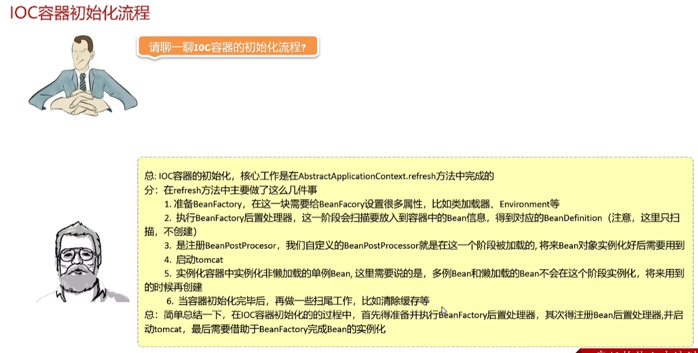

### 前置知识 ApplicationContextInitializer

1 ApplicationContextInitializer如何使用？
 - 自定义类，实现ApplicationContextInitializer接口
 - 在META-INF/spring.factories配置文件中配置自定义类

2 initializer方法什么时候执行？
 - IOC容器对象创建完成后执行，常用于环境属性注册

### 前置知识 ApplicationListener

1 ApplicationListener如何使用？
- 自定义类，实现ApplicationListener接口
- 在META-INF/spring.factories配置文件中配置自定义类
2 oaApplincationEvent方法什么时候执行？
- IOC窗口发布事件之后执行，通常用于资源加载，定时任务发布等

### 前置知识 BeanFactory

常用实现类如下面2张图

1 BeanFactory的作用？
- Bean容器的根接口，提供Bean对象的创建、配置、依赖注入等功能

2 BeanFactory常见的两个实现？
- ApplicationConfigServletServerApplicationContext
- DefaultListableBeanFactory

### 前置知识 BeanDefinintion

### 前置知识 BeanFactoryPostProcessor

### 前置知识 Aware

### 前置知识 InitializingBean/DisposableBean

### 前置知识 BeanPostProcessor

## 面试
### SpringBoot启动顺序

### IOC容器初始化流程

### Bean生命周期

### Bean循环依赖

### SpringMVC执行流程

